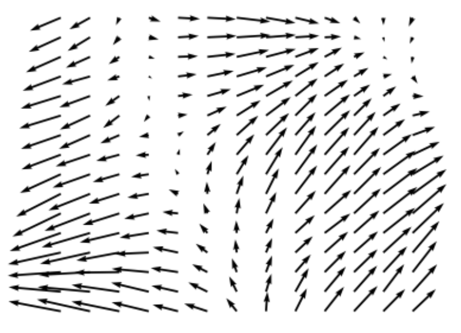

# Summary

Markov Chain Monte Carlo is a cornerstone of statistical methods that allows us to approximate intractable quantities by sampling from complex, multivariate probability distributions. One important class of distributions is constrained distributions. We present `tmg-hmc`: a Python implementation of the Exact Hamiltonian Monte Carlo for Truncated Multivariate Gaussians with linear and quadratic inequality constraints presented by Pakman and Paninski [@Pakman:2014]. This method leverages the high-dimensional scalability and well-mixing properties of Hamiltonian Monte Carlo while maintaining speed and simplicity since the Hamiltonian equations for a Gaussian distribution are analytically solvable. This means that the sampler always accepts and there are no tunable parameters. The original authors created an R implementation `tmg` and a matlab implementation `hmc_tmg`. Both of these implementations are no longer maintained and R package was archived from CRAN in 2021. There are also two R packages `VeccTMVN` and `nntmvn` that can sample truncated multivariate Gaussians, however these implementations are limited to linear Box constraints. Tp the best of our knowledge, `tmg-hmc` is the only existing Python implementation of Exact HMC. Additionally, we expand our implementation by including sparse matrix operations for sparse constraint handling and optional GPU acceleration for high-dimensional problems such as truncated Gaussian processes. Finally, we accelerate the Quadratic constraint hit time calculation by using a speed optimized C++ implementation that can be called from Python.
 
# Statement of need

Markov Chain Monte Carlo has been a foundational statistical technique that allows the approximation of intractable quantities from samples of complex, multivarate probability distriutions [@Robert:1999]. This has allowed for significant progress in statistical modeling in many areas of applied statistics and machine learning [@Gelman:1995] and more recently has helped enable the training of machine learning models for simulation based inference techniques [@Cranmer:2020; @Brehmer:2022]. One important class of distributions that arises due to parameter or data constraints are truncated distributions [@Gelfand:1992; @Stanley:2025; @Swiler:2020]. 

Pakman and Paninski consider sampling a $d$-dimensional Gaussian $X \sim N(\mu,\Sigma)$ that is truncated with $m$ inequality constraints of the form 
$$Q_j(X) \geq 0\quad\quad j=1,\hdots,m$$
where $Q_j(X)$ is a product of linear and quadratic polynomials. As discussed by Pakman and Paninski, this type of distribution is critical to a vast array of Bayesian models including the probit and Tobit models [@Tobin:1958; @Albert:1993], the dichotomized Gaussian model [@Emrich:1991; Cox:2002], stochastic integrate-and-fire neural models [@Paninski:2003], Bayesian isotonic regression [@Neelon:2004], and the Bayesian bridge model [@Polson:2014].

More recently distributions of this form have been used for learning partially censored Gaussian processes [@Cao:2025]. The Exact HMC algorithm was used to implement physics-informed constraints for fields governing CO2 flux in the WOMBAT v2.0 hierarchical flux-inversion framework for inferring changes to the global carbon cycle [@Bertolacci:2024]. Additionally, sampling constrained multivariate normals is relevant to a growing range of literature on constrained Gaussian processes [@Bachoc:2019; @Bachoc:2022; @Swiler:2020; @Agrell:2019; @De_veiga:2012; @Lopez-lopera:2018; @Maatouk:2017]. In particular, ongoing research uses `tmg-hmc` to sample random transport maps derived from 2d convex Gaussian processes which are approximated using a sequence of quadratic inequality constraints \autoref{fig:tmap} shows an example transport map sampled using `tmg-hmc`.

{ width=20% }

Exact HMC is not the only method for sampling distributions of this family, two main alternatives include Hamiltonian Monte Carlo and Gibbs Sampling with the Hit and Run Algorithm [@Deely:1992]. HMC is a fast-mixing algorithm that is robust to high numbers of dimensions. However, generally speaking, it requires integrating equations of motion and using a Metropolis accept-reject step to account for numerical integration error. The numerical integration also comes with its own tunable hyperparameters that must be adjusted to balance exploration of the state space with a high acceptance probability [@Hoffman:2024]. On the other hand, Gibbs is a simpler method with no hyperparameters that always accepts samples, however, it can be slow to mix, particularly when constraints impose high correlation between parameters. Since the Gaussian HMC trajectories are analytically computable Exact HMC enables the best of both options, the good mxing and high dimensional capabilities of HMC with the always accepting and no hyperparameter properties of the Gibbs sampler. See the original manuscript by Pakman and Paninski [@Pakman:2014] for a more detailed discussion of the differences between these methods. Some other alternative methods of sampling truncated multivariate Gaussian distributions include the R packages `VeccTMVN`[@Cao:2024] and `nntmvn` [@Cao:2025] which use respectively Vecchia and nearest neighbor approoximations to sample from a truncated Gaussian. However these methods are limited to sampling Gaussians with linear box constraints. `tmg-hmc` is developed as a flexible, user friendly and well tested Python package so that anyone can leverage the benefits of exact HMC without needing to dwell on the technical details.

# Basic Usage

`tmg-hmc` operates predominantly through the `TMGSampler` class where users specify the untruncated distribution, add constraints and then sample from the truncated distribution. All of the HMC trajectories and constraint hit time solutions will be handled automatically behind the scenes by the class internals.

```python
import numpy as np
from tmg_hmc import TMGSampler

# Set up untruncated distribution parameters
mu = np.array([0., 1.]).reshape(-1,1)
sigma = np.array([[1., 0.6],[0.6, 1.]])
sampler = TMGSampler(mu, sigma)

# Add constraints 
# Second coordinate positive
f_positivity = np.array([0., 1.]).reshape(-1,1)
c_positivity = 0
sampler.add_constraint(f=f_positivity, c=c_positivity)

# Bounded outside of unit circle
A_unit = np.eye(2)
c_unit = -1
sampler.add_constraint(A=A_unit, c=c_unit)

# Run the exact HMC sampling algorithm
x0 = np.array([2., 1.]).reshape(-1,1)
samples = sampler.sample(x0, n_samples=1000, burn_in=100)
```

# Acknowledgments

This work is partially supported by the U.S. National Science Foundation under Grant
No. DMS-2310632

# References