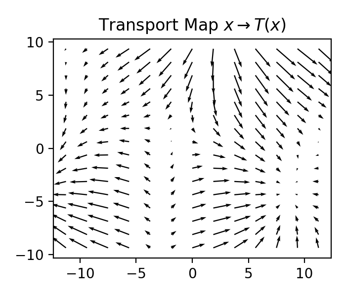

# Summary

Markov Chain Monte Carlo is a cornerstone of statistical methods that allows us to approximate intractable quantities by sampling from complex, multivariate probability distributions. One important class of distributions is constrained distributions. We present `tmg-hmc`: a Python implementation of the Exact Hamiltonian Monte Carlo for Truncated Multivariate Gaussians with linear and quadratic inequality constraints introduced in @Pakman:2014. This method leverages the high-dimensional scalability and good mixing properties of Hamiltonian Monte Carlo while maintaining speed and simplicity since the Hamiltonian equations for a truncated Gaussian distribution are analytically solvable. This means that the sampler always accepts the sampled value and there are no tunable parameters. The original authors created an R implementation `tmg` and a Matlab implementation `hmc_tmg`. Both of these implementations are no longer maintained and the R package was archived from CRAN in 2021. @Bertolacci:2024 partially implements the exact HMC in R, however, this implementation is limited to only linear constraints. There are also two R packages, `VeccTMVN` and `nntmvn`, that can sample truncated multivariate Gaussians. However, these implementations are both approximate and limited to linear box constraints. To the best of our knowledge, `tmg-hmc` is the only existing Python implementation of Exact HMC. Additionally, we expand our implementation by including sparse matrix operations for sparse constraint handling and optional GPU acceleration for high-dimensional problems such as truncated Gaussian processes. Finally, we accelerate the quadratic constraint hit-time calculation by using a speed-optimized C++ implementation that can be called from Python.
 
# Statement of need

<!-- ## Must Include
* Clearly states what problems the software is designed to solve
* Identifies who the target audience is
* Explains the software's relation to other work in the field -->

Many statistical models of real-world phenomena require the computation of intractable integrals over complex, multivariate probability distributions. Markov Chain Monte Carlo is a foundational statistical method that allows can be used to approximate these quantities from samples [@Robert:1999]. This has allowed for significant progress in statistical modeling in many areas of applied statistics and machine learning [@Gelman:2013]. One important class of distributions that arises due to parameter or data constraints are truncated distributions [@Gelfand:1992; @Swiler:2020; @Stanley:2025]. 

@Pakman:2014 consider sampling a $d$-dimensional Gaussian $X \sim N(\mu,\Sigma)$ that is truncated with $m$ inequality constraints of the form 
$$Q_j(X) \geq 0,\quad\quad j=1,\hdots,m,$$
where $Q_j(X)$ is a product of linear and quadratic polynomials. As discussed by Pakman and Paninski, this type of a distribution is a critical component of a vast array of statistical models including the probit and Tobit models [@Tobin:1958; @Albert:1993], the dichotomized Gaussian model [@Emrich:1991; @Cox:2002], stochastic integrate-and-fire neural models [@Paninski:2003], Bayesian isotonic regression [@Neelon:2004], and the Bayesian bridge model [@Polson:2014].

More recently, distributions of this form have been used for learning partially censored Gaussian processes [@Cao:2025]. The Exact HMC algorithm was used to implement physics-informed constraints for fields governing CO2 flux in the WOMBAT v2.0 hierarchical flux-inversion framework for inferring changes to the global carbon cycle [@Bertolacci:2024]. Additionally, sampling constrained multivariate normals is relevant to a growing range of literature on constrained Gaussian processes [@Bachoc:2019; @Bachoc:2022; @Swiler:2020; @Agrell:2019; @DaVeiga:2012; @Lopez:2018; @Maatouk:2017]. 

# Research Impact Statement

<!-- The paper must provide evidence of either

## Realized Impact
* Publications using the software
* Evidence of external use and adoption
* Integration with other research tools or workflows status

## OR credible near-term significance
* Benchmark results demonstrating improvements
* Reproducible research materials showing capabilities
* Community-readiness signals (e.g. requests from other groups, presentations at relevant venues)
The evidence should be compelling and specific, not aspirational. -->


In our ongoing research, we are using `tmg-hmc` to sample random transport maps given by the gradient of 2d convex Gaussian processes. We do this by approximating the convex GP by imposing quadratic convex inequality constraints on a discrete spatial grid. \autoref{fig:tmap} shows an example of such a transport map sampled using `tmg-hmc`. For context, one constraint is positivity for $~400$ coordinates. If we were to naively rejection sample with only these positivity constraints the acceptance probability would be $~1/2^{400}$ which is completely infeasible. We also tested sampling by using a linearly constrained region as a proposal distribution and then rejection sampling to get to the convexity constraint, in this case we get an acceptance propability of $~1/10^4$ which is improved over naive rejection sampling, but still infeasible for most applications. `tmg-hmc` allows us to sample directly from the convex Gaussian process distribution and we are able to sample several thousand samples per second.

{ width=50% }

Preliminary work, including our use of `tmg-hmc` was presented at two venues and has drawn considerable interest from the community. Additionally this work is set to be submitted later this year.

# State of the Field

<!-- Authors must describe how their software compares to other commonly-used packages in the research area. When related tools exist, authors must provide a clear ``build vs. contribute'' justification explaining
* Their unique scholarly contribution
* Why existing alternatives are insufficient for their research needs
* What gap their software fills -->

Exact HMC is not the only method for sampling distributions of this family. Two main alternatives include classical Hamiltonian Monte Carlo [@Duane:1987; @Neal:2011]and Gibbs sampling with the Hit-and-Run Algorithm [@Chen:1992]. HMC is a fast-mixing algorithm that is robust to high numbers of dimensions. However, generally speaking, it requires integrating equations of motion and using a Metropolis accept-reject step to account for numerical integration error. The numerical integration also comes with its own tunable hyperparameters that must be adjusted to balance exploration of the state space with a high acceptance probability [@Hoffman:2014]. On the other hand, Gibbs sampling is a simpler method with no hyperparameters that always accepts samples, however, it can be slow to mix, particularly when constraints impose high correlation between variables. Since the constrained Gaussian HMC trajectories are analytically computable Exact HMC enables the best of both options, the good mixing and high-dimensional capabilities of classical HMC with the always accepting and no hyperparameter properties of the Gibbs sampler. See the original manuscript @Pakman:2014 for a more detailed discussion of the differences between these methods. Some other alternative methods for sampling truncated multivariate Gaussian distributions include the R packages `VeccTMVN` [@Cao:2024] and `nntmvn` [@Cao:2025] which use Vecchia and nearest-neighbor approximations, respectively, to sample from a truncated Gaussian. However, these methods are both approximate and limited to sampling Gaussians with linear box constraints. 

While there are some existing implementations of exact HMC, to the best of our knowledge there are no existing Python implementations. The original authors created an R implementation `tmg` and a Matlab implementation `hmc_tmg`. Both of these implementations are no longer maintained and the R package was archived from CRAN in 2021. @Bertolacci:2024 partially implements the exact HMC method in R, however, this implementation is limited to only linear constraints. `tmg-hmc` is developed as a flexible, user friendly and well tested Python package so that anyone can leverage the full benefits of Exact HMC with quadratic inequality constraints without needing to dwell on the technical details.

# Software Design
<!-- The paper must include a section explaining the architectural choices made:

* Trade-offs considered during design
* The design/architecture chosen and why
* Why these choices matter for the research application -->

<!-- Example section:

`Gala`'s design philosophy is based on three core principles: (1) to provide a
 user-friendly, modular, object-oriented API, (2) to use community tools and 
 standards (e.g., Astropy for coordinates and units handling), and (3) to use
 low-level code (C/C++/Cython) for performance while keeping the user interface
 in Python. Within each of the main subpackages in `gala` (`gala.potential`, 
 `gala.dynamics`, `gala.integrate`, etc.), we try to maintain a consistent API 
 for classes and functions. For example, all potential classes share a common 
 base class and implement methods for computing the potential, forces, density, 
 and other derived quantities at given positions. This also works for 
 compositions of potentials (i.e., multi-component potential models), which 
 share the potential base class but also act as a dictionary-like container for 
 different potential components. As another example, all integrators implement a 
 common interface for numerically integrating orbits. The integrators and core 
 potential functions are all implemented in C without support for units, but the 
 Python layer handles unit conversions and prepares data to dispatch to the C 
 layer appropriately.Within the coordinates subpackage, we extend Astropy's 
 coordinate classes to add more specialized coordinate frames and 
 transformations that are relevant for Galactic dynamics and Milky Way research. -->

`tmg-hmc` is designed predominantly with two overarching principles: (1) ease of use, (2) performance optimization. We recognize that, as a sampling algorithm, `tmg-hmc` will predominantly be used in the beginning of a much larger research pipeline. For ease of use, we create an object-oriented API based around the public facing `TMGSampler` class where end users can specify the unconstrained distribution, add constraints and then run the sampler. One important example of ease of use is how the sampler handles distributions with nonzero mean and non identity covariance. The exact HMC algorithm requires a zero mean, identity covariance distribution so the sampler automatically rescales the input starting samples and adjusts the provided constraints to operate in the rescaled environment. Then after sampling, the samples are transformed to their original scale. This way end users need not be familiar with the fine details of the sampling algorithm and can use `tmg-hmc` much the same way that they would sample from a `scipy.stats` distribution. Additionally, we minimize the number of dependencies in this package so that it won't conflict with any other required packages for other aspects of the research pipeline. For performance optimization, we implement sparse constraint and GPU based implementations that are controlled by the user through a `sparse` and `gpu` flag in the initial class constructor. Additionally, we found that the three types of constraints `LinearConstraint`, `SimpleQuadraticConstraint`, and `FullQuadraticConstraint` have very different computational demands and hit time calculation speeds. So, after rescaling the input constraints, the sampler class will automatically pick the simplest constraint type allowable for the rescaled constraint parameters. Finally, after profiling the original, all Python, implementation we found the major speed bottleneck to be the full quadratic constraint hit time. So we rewrote this calculation in C++ with Python bindings and optimized the implementation to remove all redundant calculations.

# Basic Usage

`tmg-hmc` operates predominantly through the `TMGSampler` class where a user specifies the untruncated distribution, adds constraints and then samples from the truncated distribution as illustrated in the example code below. All of the HMC trajectories and constraint hit-time solutions are handled automatically behind the scenes by the class internals.

```python
import numpy as np
from tmg_hmc import TMGSampler

# Set up untruncated distribution parameters
mu = np.array([0., 1.]).reshape(-1,1)
sigma = np.array([[1., 0.6],[0.6, 1.]])
sampler = TMGSampler(mu, sigma)

# Add constraints 
# Second coordinate positive
f_positivity = np.array([0., 1.]).reshape(-1,1)
c_positivity = 0
sampler.add_constraint(f=f_positivity, c=c_positivity)

# Bounded outside of unit circle
A_unit = np.eye(2)
c_unit = -1
sampler.add_constraint(A=A_unit, c=c_unit)

# Run the exact HMC sampling algorithm
x0 = np.array([2., 1.]).reshape(-1,1)
samples = sampler.sample(x0, n_samples=1000, burn_in=100)
```

# AI Usage Disclosure
<!-- The paper must include a section that transparantly discloses any use of generative AI in:
* Software creation or development
* Documentation writing
* Paper authoring
If AI tools were used, authors should describe how they were used and how the quality and correctness of AI-generated content was verified. -->

For software creation and development, we used Anthropic's Claude 3.7 Sonnet to optimize the C++ implementation of the Exact HMC hit times to quadratic constraints by removing redundant calculations. To do this, we initially solved the hit times analytically as shown in the Mathematica notebook located in resources/HMC_exact_soln.nb in the `tmg-hmc` repository. This resulted in a set of 8 solutions that were each a long mathematical expression taking over a page to write down. Then we used Mathematica's `CForm` command to convert the expression to C. We then told Claude that the 8 C functions represented a solution set and should follow a pattern and we asked Claude to parse the functions for a pattern and rewrite them without performing any reduntant calculations. 

To test the correctness of the generated code we first tested that the code would compile. We then tested that the output hit-times were close to the original C hit times ouput from mathematica within a numerical tolerance for a small set of test cases. Finally, we ran the sampler and tested that the sampled points reached and did not exceed the quadratic constraint bounds which is only possible if the hit times are correct. This lead to about 15 iterations of testing the output code and asking Claude to refine its work because it wasn't correct. Then we finally got to a point where about half of the hit times appeared to be correct. This was an issue we had previously encountered with the Python implementation which was fixed by using complex arithmetic. So we manually made this change to the C++ implementation which fixed the final issue. Generative AI was not used for any other aspect of software creation and development.

For documentation writing we used Claude to provide an initial scaffolding of the Readme.md file which was manually edited and adjusted to ensure correctness and consistency with the package. Additionally, we used Claude to create a custom generate docs workflow that would build the API_DOCS.md file from Python doscstrings. We used a custom workflow so that we could control how custom types used in type hints were displayed in the rendered documentation. We tested the correctness by running the GitHub workflow and adjusting as needed.

Generative AI was not used for any aspect of paper writing.

# Acknowledgments

This work was partially supported by the U.S. National Science Foundation under Grant
No. DMS-2310632. 

# References