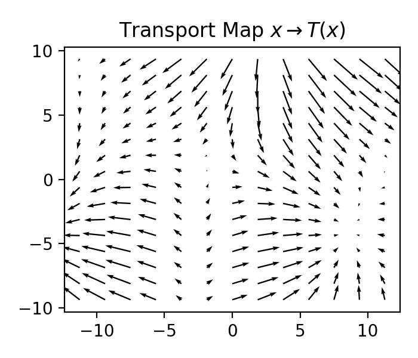

# Summary

Markov Chain Monte Carlo is a cornerstone of statistical methods that allows us to approximate intractable quantities by sampling from complex, multivariate probability distributions. One important class of distributions is constrained distributions. We present `tmg-hmc`: a Python implementation of the Exact Hamiltonian Monte Carlo for Truncated Multivariate Gaussians with linear and quadratic inequality constraints introduced in @Pakman:2014. This method leverages the high-dimensional scalability and good mixing properties of Hamiltonian Monte Carlo (HMC) while maintaining speed and simplicity since the Hamiltonian equations for a truncated Gaussian distribution are analytically solvable. This means that the sampler always accepts the sampled value and there are no tunable parameters. The original authors created an R implementation `tmg` and a Matlab implementation `hmc_tmg`. Both of these implementations are no longer maintained and the R package was archived from CRAN in 2021. @Bertolacci:2024 partially implements the Exact HMC in R, however, this implementation is limited to only linear constraints. There are also two R packages, `VeccTMVN` and `nntmvn`, that can sample truncated multivariate Gaussians. However, these implementations are both approximate and limited to linear box constraints. To the best of our knowledge, `tmg-hmc` is the only existing Python implementation of Exact HMC. Additionally, we expand our implementation by including sparse matrix operations for sparse constraint handling and optional GPU acceleration for high-dimensional problems such as truncated Gaussian processes. Finally, we accelerate the quadratic constraint hit-time calculation by using a speed-optimized C++ implementation that can be called from Python.
 
# Statement of need

Many statistical models of real-world phenomena require the computation of intractable integrals over complex, multivariate probability distributions. Markov Chain Monte Carlo is a foundational statistical method that can be used to approximate these quantities from samples [@Robert:1999]. This has allowed for significant progress in statistical modeling in many areas of applied statistics and machine learning [@Gelman:2013]. One important class of distributions that arises due to parameter or data constraints are truncated distributions [@Gelfand:1992; @Swiler:2020; @Stanley:2025]. 

In @Pakman:2014, Exact HMC is used to sample from a $d$-dimensional Gaussian $X \sim N(\mu,\Sigma)$ that is truncated with $m$ inequality constraints of the form 
$$Q_j(X) \geq 0,\quad\quad j=1,\hdots,m,$$
where $Q_j(X)$ is a product of linear and quadratic polynomials. As discussed by Pakman and Paninski, this type of a distribution is a critical component of a vast array of statistical models including the probit and Tobit models [@Tobin:1958; @Albert:1993], the dichotomized Gaussian model [@Emrich:1991; @Cox:2002], stochastic integrate-and-fire neural models [@Paninski:2003], Bayesian isotonic regression [@Neelon:2004], and the Bayesian bridge model [@Polson:2014].

More recently, distributions of this form have been used for learning partially censored Gaussian processes [@Cao:2025]. The Exact HMC algorithm was used to implement physics-informed constraints for fields governing CO2 flux in the WOMBAT v2.0 hierarchical flux-inversion framework for inferring changes to the global carbon cycle [@Bertolacci:2024]. Additionally, sampling constrained multivariate normals is relevant to a growing range of literature on constrained Gaussian processes [@Bachoc:2019; @Bachoc:2022; @Swiler:2020; @Agrell:2019; @DaVeiga:2012; @Lopez:2018; @Maatouk:2017]. 

# Research Impact Statement

In our ongoing statistical research, we are using `tmg-hmc` to sample random transport maps given by the gradient of 2d convex Gaussian processes. We do this by approximating the convex GP by imposing quadratic convex inequality constraints on a discrete spatial grid. \autoref{fig:tmap} shows an example of such a transport map sampled using `tmg-hmc`. For context, one constraint is positivity of the second derivative for $416$ coordinates. If we were to naively rejection sample with just these positivity constraints for a GP with small length scales so that the locations are approximately independent, the acceptance probability would approach $1/2^{416}$ which is completely infeasible. We also tested sampling by using a linearly constrained region as a proposal distribution and then rejection sampling to get to the convexity constraint, in this case we get an acceptance propability of $\approx1/10^4$ which is improved over naive rejection sampling, but still infeasible for most applications. `tmg-hmc` allows us to sample directly from the convex Gaussian process distribution and we are able to sample several thousand samples per second.

{ width=50% }

Preliminary work, including our use of `tmg-hmc`, has already been presented at several scientific conferences and has drawn considerable interest from the statistical and geoscientific communities. Additionally, this work on random transport maps for geoscientific modelins is set to be submitted later this year.

# State of the Field

Exact HMC is not the only method for sampling distributions of this family. Two main alternatives include classical Hamiltonian Monte Carlo [@Duane:1987; @Neal:2011] and Gibbs sampling with the Hit-and-Run Algorithm [@Chen:1992]. HMC is a fast-mixing algorithm that is robust to high numbers of dimensions. However, it requires integrating equations of motion and using a Metropolis accept-reject step to account for numerical integration error. The numerical integration requires adjusting hyperparameters to balance state space exploration with a high acceptance probability [@Hoffman:2014]. Gibbs sampling is a simpler method with no hyperparameters that always accepts samples, however, it can be slow to mix, particularly when constraints impose high correlation between variables. Since the constrained Gaussian HMC trajectories are analytically computable, Exact HMC enables the good mixing and high-dimensional capabilities of classical HMC with the always accepting and no hyperparameter properties of the Gibbs sampler. See @Pakman:2014 for a more detailed discussion of the differences between these methods. Other alternative methods include the R packages `VeccTMVN` [@Cao:2024] and `nntmvn` [@Cao:2025] which use Vecchia and nearest-neighbor approximations, respectively, to sample from a truncated multivariate Gaussian. However, these methods are both approximate and limited to sampling Gaussians with linear box constraints. 

While there are some existing implementations of Exact HMC, to the best of our knowledge there are no existing Python implementations. @Pakman:2014 created an R implementation `tmg` and a Matlab implementation `hmc_tmg`; however, both are no longer maintained and the R package was archived from CRAN in 2021. Additionally, @Bertolacci:2024 partially implements the Exact HMC method in R but only for linear constraints.

# Software Design

`tmg-hmc` is designed predominantly with two overarching principles: (1) ease of use, (2) performance optimization. As a sampling algorithm, `tmg-hmc` will predominantly be used as part of a much larger research pipeline. For ease of use, we created an object-oriented API based around the public facing `TMGSampler` class where end users can specify the unconstrained distribution, add constraints and then run the sampler. One important example of ease of use is how the sampler handles distributions with nonzero mean and non identity covariance. The Exact HMC algorithm requires a zero mean, identity covariance distribution so the sampler automatically rescales the input starting samples and adjusts the provided constraints to operate in the rescaled environment. Then, after sampling, the samples are transformed to their original scale. This way end users need not be familiar with the fine details of the sampling algorithm and can use `tmg-hmc` much the same way that they would sample from a `scipy.stats` distribution. Additionally, we minimized the number of dependencies in this package so that it won't conflict with any other required packages for other aspects of the research pipeline. For performance optimization, we implemented sparse-constraint and GPU-based accelerators that are controlled by the user through `sparse` and `gpu` flags in the initial class constructor. Additionally, we found that the three types of constraints --- `LinearConstraint`, `SimpleQuadraticConstraint`, and `FullQuadraticConstraint` --- have very different computational demands and hit-time calculation speeds. So, after rescaling the input constraints, the sampler class will automatically pick the simplest constraint type allowable for the rescaled constraint parameters. Finally, after profiling the original, all Python, implementation we found the most significant speed bottleneck to be the `FullQuadraticConstraint` hit time. So we optimized the implementation and rewrote it in C++ with Python bindings.

# AI Usage Disclosure

We used Anthropic's Claude 3.7 Sonnet to optimize the C++ implementation of the Exact HMC hit times to quadratic constraints by removing redundant calculations. To do this, we initially solved the hit times analytically as shown in the Mathematica notebook located in resources/HMC_exact_soln.nb in the `tmg-hmc` repository. This resulted in a set of 8 solutions that were each a long mathematical expression taking over a page to write down. Then we used Mathematica's `CForm` command to convert the expression to C. We then told Claude that the 8 C functions represented a solution set and should follow a pattern and asked Claude to parse the functions for a pattern and rewrite them without performing any reduntant calculations. By doing this we were able to simplify the $\approx1000$ lines of nested mathematical expressions in the original C implementation to a single $\approx90$ line function. We also saw a nearly 100 times speedup in the hit-time calculation from the original Python implementation after simplifying the expressions compared to an initial speedup of 5 times from just converting the Python implementation to C++.

To test the correctness of the generated code, we first tested that the code would compile. We then tested that the output hit times were close to the original C hit times from Mathematica within a numerical tolerance for a small set of test cases. Finally, we ran the sampler and tested that the sampled points reached and did not exceed the quadratic constraint bounds which is only possible if the hit times are correct. This led to about 15 iterations of testing the output code and asking Claude to refine its work because it was not correct. Then we finally got to a point where about half of the hit times appeared to be correct. This was a previously encountered issue with the Python implementation with a known solution. So we manually made this change to the C++ implementation which fixed the final issue and produced correct hit times in all of our tests. 

For documentation writing, we used Claude to provide an initial Readme.md draft which was manually edited to ensure correctness. Additionally, we used Claude to create a custom generate docs workflow that would build the API_DOCS.md file from Python doscstrings. We used a custom workflow so that we could control how custom types were displayed in the rendered documentation. We tested this for correctness by running the GitHub workflow and adjusting as needed.

Generative AI was not used for any aspect of paper writing.

# Acknowledgments

This work was partially supported by the U.S. National Science Foundation under Grant
No. DMS-2310632. 

# References